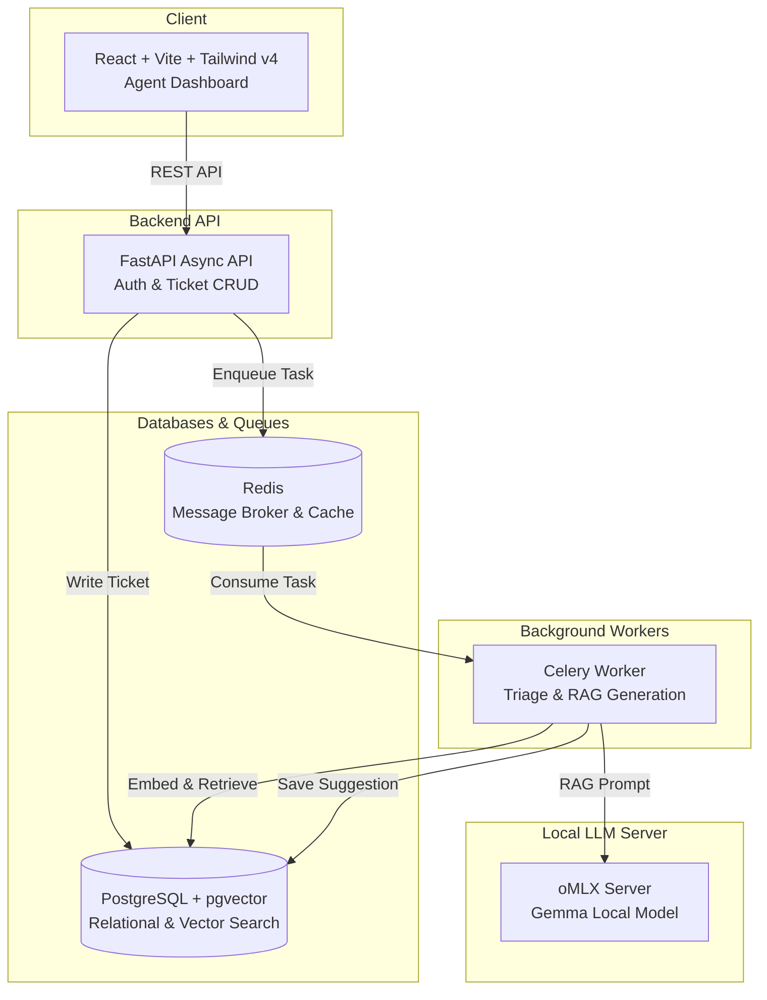

# AI Support Desk

A production-ready, full-stack customer support platform featuring an integrated, local **Retrieval-Augmented Generation (RAG)** pipeline.

This project demonstrates local-first AI engineering, asynchronous task processing, and multi-tenant security architecture.

---

# 🏗️ Architecture & Data Flow



---

# 📐 Key Architectural Decisions

### Decoupled AI Processing

LLM inference typically takes between **1–5 seconds**. Running model inference inside the API request-response cycle would block worker threads and significantly increase response times.

By moving ticket triage and RAG reply generation into a dedicated Celery worker, ticket creation remains extremely responsive (typically under **20 ms**) while AI tasks execute asynchronously.

### Unified Database (PostgreSQL + pgvector)

Instead of maintaining separate relational and vector databases, the system stores both application data and embeddings inside PostgreSQL using **pgvector**.

Benefits include:

* Single source of truth
* No double-write synchronization issues
* Native SQL filtering before vector search
* Simplified deployment and maintenance

### Local-First AI Development

The complete AI pipeline runs locally:

* Embeddings are generated in-process using **sentence-transformers** on CPU.
* Response generation is handled by a locally hosted **oMLX** server running a quantized Gemma model.
* Development requires **zero external API credits**.

---

# 🛠️ Technology Stack

| Layer           | Technology                                           | Rationale                                                             |
| --------------- | ---------------------------------------------------- | --------------------------------------------------------------------- |
| **Frontend**    | React, Vite, Tailwind CSS v4, TanStack Query         | Responsive UI with efficient server-state synchronization and caching |
| **Backend API** | FastAPI, Python 3.11, SQLAlchemy 2.0 Async, Pydantic | Modern async architecture with automatic validation                   |
| **Task Queue**  | Celery + Redis                                       | Reliable background processing for AI workflows                       |
| **Database**    | PostgreSQL 16 + pgvector                             | Native vector similarity search with HNSW indexing                    |
| **AI Models**   | sentence-transformers + oMLX                         | Fully local embedding generation and LLM inference                    |

---

# 🚀 Key Features

## 🔐 Role-Based Access Control (RBAC)

* Customers can view only their own tickets.
* Agents can access tickets belonging to their organization.
* Admins have organization-wide visibility and management capabilities.

---

## 🔄 Silent Token Refresh

A custom Axios interceptor automatically queues failed requests during authentication refresh, allowing seamless user sessions without interrupting ongoing work.

---

## 🤖 Background AI Triage

Every newly created ticket is automatically processed by a Celery worker to extract:

* Category
* Priority
* Sentiment

This classification is performed using the locally hosted LLM.

---

## 📚 Retrieval-Augmented Generation (RAG)

When a ticket is created:

1. The ticket is embedded using a local embedding model.
2. PostgreSQL performs cosine similarity search across resolved tickets.
3. The top three most relevant tickets from the same organization are retrieved.
4. Their successful responses are injected into the prompt.
5. The local LLM generates a suggested reply draft for support agents.

---

# 🔧 Installation & Local Setup

## 1. Prerequisites

Ensure the following are installed:

* Docker
* Python 3.11+
* Node.js 18+
* Local oMLX model server

---

## 2. Start PostgreSQL & Redis

```bash
docker compose up -d postgres redis
```

---

## 3. Backend Setup

```bash
cd backend

python -m venv .venv

# macOS / Linux
source .venv/bin/activate

pip install -r requirements.txt

# Run database migrations
alembic upgrade head

# Start FastAPI
uvicorn app.main:app --reload --port 8001
```

Open another terminal and start the Celery worker:

```bash
cd backend

source .venv/bin/activate

celery -A worker.celery_app worker --loglevel=info
```

---

## 4. Frontend Setup

```bash
cd frontend

npm install

npm run dev
```

---

# 📓 Lessons Learned & Troubleshooting

## Celery Process Fork vs GPU Contexts

PyTorch GPU initialization on macOS can fail after process forks, resulting in:

* `SIGSEGV`
* `MTLCompiler` sandbox warnings

### Resolution

* Lazy-load model instances
* Use singleton initialization
* Force embedding generation to execute on CPU

---

## SQLAlchemy Async Event Loop Mismatches

Reusing pooled async database connections across forked Celery workers caused intermittent crashes.

### Resolution

Explicitly dispose of the async engine at the end of worker execution:

```python
await engine.dispose()
```

This guarantees fresh connections for each task and prevents event-loop reuse issues.

---

# ✨ Project Highlights

* ✅ Full-stack customer support platform
* ✅ Multi-tenant architecture
* ✅ Local-first AI workflow
* ✅ Retrieval-Augmented Generation (RAG)
* ✅ PostgreSQL + pgvector semantic search
* ✅ Celery background processing
* ✅ FastAPI async backend
* ✅ React + Vite frontend
* ✅ Silent authentication refresh
* ✅ Zero external AI API dependency during development
